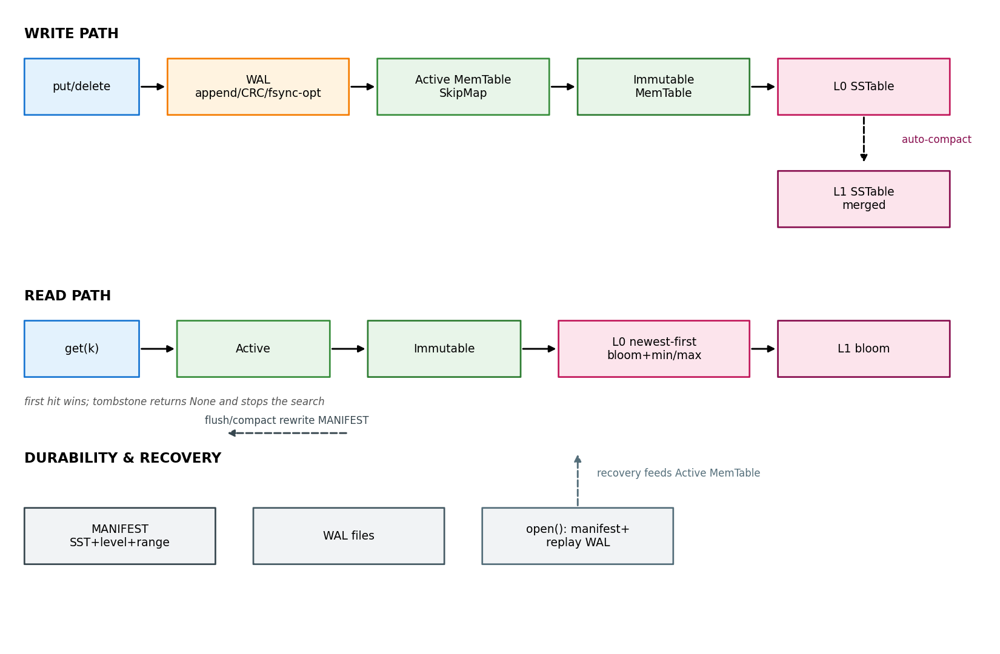
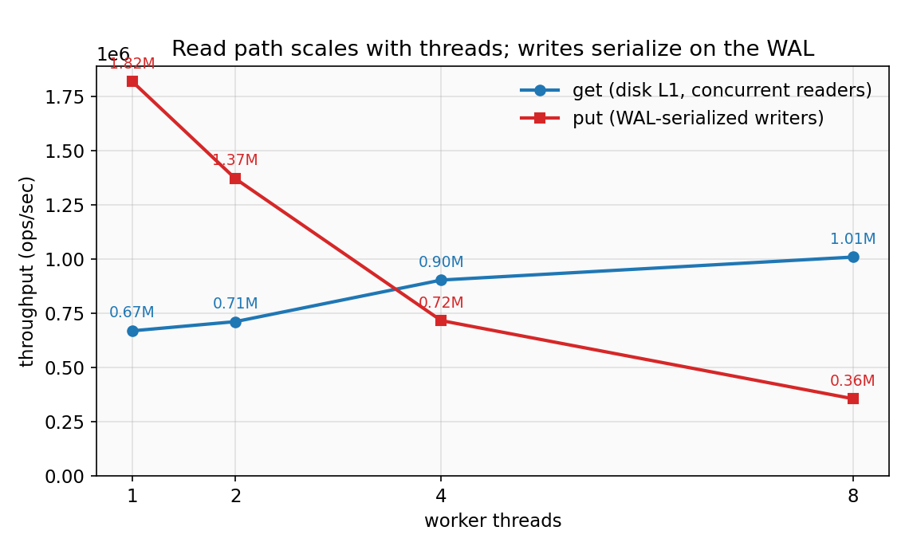
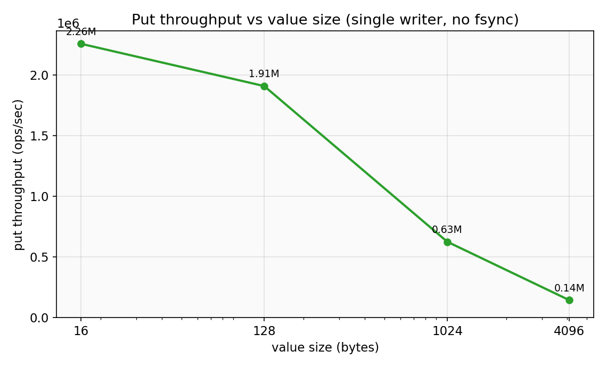

# High-Performance LSM-Tree Storage Engine

[](https://github.com/OprekerSejati/rust-lsm-db/actions/workflows/ci.yml)

An embeddable, crash-safe, and thread-safe key-value storage engine built in Rust.

**Author:** [Arya Mentary](https://www.linkedin.com/in/arya-mentary-6890a783/)  
_Open for Systems Engineering & Rust Architecture Opportunities._

Built by **Arya Mentary** to demonstrate high-performance systems engineering, low-level data structure design, and concurrent Rust practices.

---

## 🎯 The Problem It Solves

Traditional database engines relying on B-Trees often hit severe I/O bottlenecks during heavy write workloads due to random disk access. **LSM-Engine** solves this problem by utilizing a Log-Structured Merge-Tree (LSM-Tree) architecture:

- **Write Amplification Reduction:** Converts expensive random disk writes into lightning-fast, sequential append-only operations (WAL & MemTable).
- **Read Amplification Elimination:** Solves the classic LSM read penalty using in-memory **Bloom Filters** and **Sparse Indexes**, allowing key lookups to skip disk I/O entirely when data is absent (~8.7M ops/s on misses).
- **Zero-Lock Read Path:** Reads hold no global lock — they walk a concurrent lock-free SkipMap and share cached immutable SSTable snapshots, so read throughput scales with additional CPU cores (measured 1.5× gain from 1 → 8 reader threads on a single on-disk L1 table).

---

## 🚀 Key Engineering Highlights

- **High Write Throughput (durable, mixed):** ~117k ops/sec sustained with background flush + leveled compaction running concurrently (the write path itself is ~1.8M ops/s in RAM before flush/fsync — see benchmarks).
- **Ultra-Fast Short-Circuiting:** Up to ~8.7M ops/sec on lookups via zero-disk-I/O Bloom Filter probes.
- **Crash Resilience & Durability:** Atomic `MANIFEST` updates and deterministic WAL replays recover all acknowledged writes on unexpected process drops. Per-write `fsync` is available via `sync_per_write` for power-loss durability; default mode batches durability at `flush()` / clean shutdown.
- **Memory-Efficient Sparse Indexing:** ~4 KB data blocks with sparse index markers keep point lookups RAM-light (index + bloom held in memory per open table).
- **Battle-Tested Reliability:** 196 green tests (190 unit tests + 6 end-to-end multi-threaded integration tests).

---

## 🏁 Quick Start

```rust
use lsm_engine::{LsmEngine, LsmOptions};

// Open or create a database instance
let engine = LsmEngine::open("path/to/db")?;          // or open_with_options

// Synchronous Write & Read API
engine.put(b"user:1001", b"alice")?;
engine.put(b"session:xyz", b"active")?;

assert_eq!(engine.get(b"user:1001")?, Some(b"alice".to_vec()));

// Tombstone deletion
engine.delete(b"session:xyz")?;
assert_eq!(engine.get(b"session:xyz")?, None);

// Explicit synchronization & background operations
engine.flush()?;      // Durability point: WAL sync + drain MemTables to L0 SSTs
engine.compact()?;    // Merge L0+L1 into a single sorted L1 table
```

### Tuning Knobs (`LsmOptions`)

| Option                         | Default  | Purpose / Trade-off                                                                                 |
| ------------------------------ | -------- | --------------------------------------------------------------------------------------------------- |
| `flush_threshold_bytes`        | `64 MiB` | Freezes the active MemTable and triggers a background flush once reached.                           |
| `sync_per_write`               | `false`  | When `true`, calls `fsync` after every `put`/`delete` (maximum durability, lower write throughput). |
| `compaction_l0_file_threshold` | `4`      | Triggers auto-compaction when L0 files stack up; set to `0` to disable.                             |

`LsmEngine` is cheaply `Clone`able (shared interior state via `Arc`) and thread-safe. Every writer acquires the WAL mutex before mutating the MemTable, while readers access lock-free snapshots without blocking global execution.

---

## 🏗️ Architecture & Data Pipeline



Data flows through a classic multi-tiered LSM pipeline designed for durability and performance:

```
put / delete
   │
   ├──► (1) Append to WAL (.wal)            → Crash Safety & Durability
   │
   ▼
Active MemTable (Lock-free SkipMap)
   │
   ├──► (2) Frozen when size > flush_threshold_bytes
   │
   ▼
Immutable MemTables ── background worker ──► L0 SSTable (.sst)
                                                │
                                                ├──► (3) Auto-compact when L0 count ≥ threshold
                                                │
                                                ▼
                                          L1 SSTable (Merged, tombstone-free)
```

### Lookup Cascade (Newest → Oldest)

`Active MemTable` → `Immutable MemTables` → `L0 SSTables` (newest file wins) → `L1 SSTables`.

- **File Pruning:** Skips SSTables whose `[min_key, max_key]` range cannot contain the key.
- **In-Memory Filter Probe:** Short-circuits negative lookups immediately if the Bloom filter probe fails.

---

## 💾 On-Disk Binary Formats

All multi-byte integers are serialized in Little-Endian format.

### 1. WAL Entry Format

```
[CRC32 u32][Op u8][KeyLen u16][ValLen u32][Key bytes][Value bytes]
```

- `Op`: `0x01` = Put, `0x02` = Delete (Tombstone with empty value).
- `CRC32`: Covers every byte after the CRC field for checksum validation on recovery.

### 2. SSTable File Structure

```
[Data Block 0][Data Block 1] ... [Sparse Index Block][Bloom Block?][Footer]
```

- **Data Blocks:** Store ascending `[KeyLen u16][Flags u8][ValLen u32][Key][Value]` records (~4 KB target block size). Bit 0 of `Flags` marks a tombstone.
- **Sparse Index:** Maps each block's first key to `(offset, size)`. Lookups perform binary search over the index before scanning a single target block.
- **Bloom Filter Block:** Written before the footer; probed before reading any data block from disk.
- **Footer (Fixed 24 bytes):** `[Index Offset u64][Bloom Offset u64][Magic "LSMTREE1"]`.

### 3. Atomic MANIFEST

Tracks all active SSTables, their levels, and key ranges. Updated atomically via temporary file writes, `fsync`, and renames (`MANIFEST.tmp` → `MANIFEST`).

---

## 📊 Benchmark & Performance Analysis

> Generated via `cargo bench --bench scaling` on a **MacBook Pro (Apple M1 Pro, 8 performance
> cores), 16 GB RAM, macOS 26.3**, release build. Numbers reflect **relative performance scaling**
> under synthetic workloads — reproduce locally before quoting them as absolute.

| Benchmark Scenario                   | Throughput / Latency       | Key Takeaway / Architecture Behavior                               |
| ------------------------------------ | -------------------------- | ------------------------------------------------------------------ |
| `put/sequential_flush` (2k-op batch) | **~117 k ops/s**           | Mixed workload: async background flushes + compactions included.   |
| `put_threads` 1 writer (no flush)    | **~1.8 M ops/s**           | Pure WAL + MemTable write path (no fsync, no flush).               |
| `get/hot_memtable`                   | **~3.2 M ops/s** (~310 ns) | Pure lock-free SkipMap lookup in RAM.                              |
| `get/disk_l1` (Page-cache warm)      | **~580 k ops/s** (~1.7 µs) | Sparse index binary search + single block disk read.               |
| `get/miss` (Bloom short-circuit)     | **~8.7 M ops/s** (~113 ns) | Zero disk I/O; short-circuited entirely by in-memory Bloom filter. |

### Thread Scaling Insights



- **Write Scaling (WAL Bottleneck):** Writers acquire a single global WAL mutex to guarantee durability ordering. Consequently, write throughput plateaus under high concurrent writer threads.
- **Read Scaling (Zero Lock Contention):** Reads hold no global lock and share thread-safe SST handles. Read throughput scales smoothly with additional CPU cores (1.5× throughput gain from 1 → 8 reader threads on a single L1 table).

### Value Size Impact



Throughput is dominated by byte movement through the WAL and MemTable: ~2.3 M puts/s at 16 B values drops to ~0.14 M puts/s at 4 KiB values.

---

## 🛠️ Accepted Limitations & Trade-offs (v0.1)

In software engineering, every design choice involves trade-offs. Below are the known limitations of v0.1:

1. **Whole-Set Compaction:** The compactor reads all of L0 + L1 into memory and writes a single L1 table. While simple and mathematically correct, scaling to larger datasets will require Size-Tiered or Level-Partitioned compaction.
2. **Unversioned File Lifecycle:** SST files are deleted immediately after compaction. In rare edge cases, a reader holding an un-cached file handle during active compaction may encounter a transient I/O error. (Future work: Ref-counted epoch file deletion).
3. **Point Lookups Only:** Range queries (`scan` / `iter`) are internal to compaction and not yet exposed in the public API.

---

## 🧪 Testing & Verification

Run the full test suite and benchmark suite:

```sh
# Run all 190 unit tests
cargo test

# Run end-to-end multi-threaded integration tests
cargo test --test engine_integration

# Static analysis and formatting checks
cargo clippy --all-targets -- -D warnings
cargo fmt --check

# Run Criterion benchmarks
cargo bench --bench engine_bench
```

---

## 📂 Project Structure

```
src/
├── lib.rs            # Public API exports (LsmEngine, LsmOptions, LsmError)
├── error.rs          # Domain error handling via thiserror
├── memtable/         # Concurrent lock-free SkipMap implementation
├── wal/              # Append-only WAL with CRC32 checksums & recovery
├── sstable/          # On-disk tables: builder, sparse index, bloom filter, reader
├── compaction/       # Pure k-way merge algorithms over sorted runs
├── engine.rs         # LsmEngine orchestrator & background worker tasks
└── manifest.rs       # Atomic MANIFEST state metadata management
```

---

## 👤 Author & Contact

Built by **Arya Mentary** to demonstrate high-performance systems engineering, low-level data structure design, and concurrent Rust practices.

- **LinkedIn:** [linkedin.com/in/arya-mentary-6890a783](https://www.linkedin.com/in/arya-mentary-6890a783/)

_Open for technical discussions, engineering roles, and architecture reviews._
